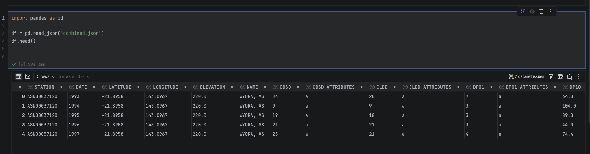

# Data Exploration Project: Ch05 MyData

Using one of the three datasets you found and discussed in **D4: Finding Data**, import your data into a Notebook and
examine your dataset to answer these questions.

---

## 1. Dataset Information
Provide the following information about your chosen dataset:

### Title of the dataset

### Direct link to the dataset
[Direct link to the dataset](https://www.ncei.noaa.gov/data/global-summary-of-the-year/access/)

### Short description/summary
Global (non-US) meteorological data. Average annual temperature, average annual minimum and maximum temperatures;
total annual precipitation and snowfall; departure from normal of the mean temperature and total precipitation;
heating and cooling degree days; number of days that temperatures and precipitation are above or below certain
thresholds; extreme annual minimum and maximum temperatures; number of days with fog; and number of days with
thunderstorms, for a location/year going back to the 18th century where applicable.

### Format
The original format was 80k+ CSV files, but I converted it to JSON and pivoted it, then gziped it to save on space.
```shell
-> % du -sh combined*
836M    combined.csv
161M    combined.csv.gz
3.7G    combined.json
2.0G    combined_pivoted.json
145M    combined_pivoted.json.gz
```
### Dimensions
(16,2608637)

### Documentation
Yes, the dataset comes with extensive documentation via the
[GSOYReadme.txt](https://www.ncei.noaa.gov/data/global-summary-of-the-year/doc/GSOYReadme.txt) file. 

This documentation provides:
- **Data Definitions**: Detailed descriptions of over 50 meteorological elements, such as average wind speed
  (`AWND`), cooling degree days (`CLDD`), and various precipitation thresholds (e.g., `DP01`, `DP10`).
- **Station Metadata**: Explanation of the GHCN ID system used to identify weather stations globally.
- **Methodology**: Details on how annual summaries are computed from daily data, including handling of
  missing values (annual values are marked missing if any month is missing).
- **Quality Control**: Information on the quality control processes applied to the GHCN-Daily dataset from which
  GSOY is derived.

This is useful for:
- **Data Interpretation**: Understanding exactly what each column name represents and the units of measurement used.
- **Data Cleaning**: Identifying how missing values or flagged data are represented in the dataset.
- **Geospatial Analysis**: Using station IDs to link data to specific geographic locations and metadata.

---

## 2. Data Import & Initial Examination
### Import your data file
After importing your dataset into a DataFrame, run a command to display the first five rows of data. 



> **Note:** The screenshot above (`head_rows.png`) shows the results of displaying the first five rows of the
> dataset in the Notebook, meeting the requirement for this section.

### Examine your data and column names
- Do you notice any potential problems? If so, what might your concerns be?
- - YES! Some of the values are comma-separated, which appear to represent some sort of list and may
  require further cleaning.
- Did you have any difficulties importing your data? If so, describe the situation?
- - The raw data listing at the URL given contained 80k+ CSV files. Downloading and importing them all into
  a single file took a long time and used a lot of memory. Perhaps loading and merging them into a single
  DataFrame would have been faster rather than creating one large CSV.
- Did you have any difficulties converting your data to a DataFrame?
- - YES! The CSV was too large to import into a DataFrame; I ran into out-of-memory issues. However,
  converting it to JSON and pivoting it saved me a lot of space and memory, loaded faster than
  non-pivoted, and finally allowed me to import it into a DataFrame.

---

## 3. Reflection
**Why do you think it is important to review documentation on your data and examine your data before
proceeding with data analysis and data visualization?**
This data is clearly quite old and uses conventions for station naming, etc., that are not intuitive. So,
it's not enough to even load the data; definitely further massaging will be in order.